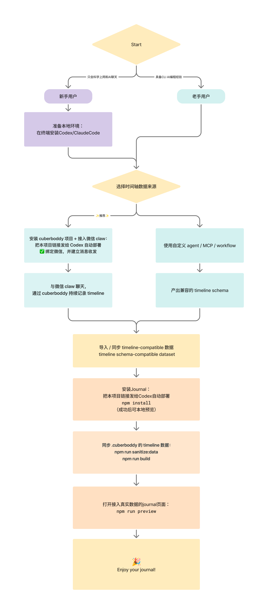

# 📓 Journal

> “让我们和 AI 对话记录，成为有温度的纸质感手帐。”


在线体验：<https://poboll.github.io/journal/>

---

## ✨ Intro

`journal` 是一个前端展示层，把结构化的时间轴事件渲染成 `daily / weekly / monthly` 三种视图。

### Journal中展示了哪些种类的数据？

依赖Timeline Schema三类数据输入：

| Input | 说明 | 是否必需 |
| --- | --- | --- |
| `timeline` | 带时间跨度的事件记录 | 必需 |
| `diary` | 每日总结与条目 | 推荐 |
| `todo` | 当天待办清单 | 可选 |

### 这些数据从何而来？

| Layer | 说明 | 是否可替换 |
| --- | --- | --- |
| `timeline schema` | `journal` 依赖的数据契约 | 当前强依赖 |
| `timeline producer` | 生成 timeline 数据的外部实现 | 可以自定义 |
| `cuberboddy` | 一种 timeline producer，也可提供完整 runtime | 推荐 |

---

## 🧭 Guided flow



## 🚪 Data

`journal` 默认消费一套 **timeline-compatible** 的结构化数据。只要数据结构满足以下契约，就可以直接接入：

- [Timeline schema](docs/schemas/timeline.md)
- [Diary schema](docs/schemas/diary.md)
- [Todo schema](docs/schemas/todo.md)

你可以通过两种方式接入：

1. 使用 `cuberboddy`
- 默认推荐路径
- 适合希望直接复用现成 runtime 和数据生产能力的用户

2. 使用你自己的 agent / MCP / workflow
- 适合不想引入 `cuberboddy` runtime 的用户
- 前提是最终能产出兼容的 `timeline schema`

换句话说，`journal` 可以和 `cuberboddy runtime` 解耦，但不能和 `timeline schema` 解耦。

---

## 🧩 Agent / 开发说明

### 环境

- 需要 Node.js 和 npm。
- 首次安装依赖：`npm install`
- 本地预览：`npm run preview`
- 手动重编译浏览器 runtime：`npm run build`
- 预览地址：`http://localhost:8767/Journal.html`

### 数据接入

- 公开示例数据位于 `data/public/`。
- `timeline` 数据入口：`data/public/timeline-state.json`
- `diary` 数据入口：`data/public/diary/*.md`
- `todo` 数据入口：`data/public/todos.json`
- 私有源数据不要提交进仓库；可以放在仓库外，或仅临时放在 `data/private-source/`。
- 如需从私有源同步示例数据，可设置：

```bash
JOURNAL_PRIVATE_TIMELINE_STATE=/path/to/timeline-state.json
JOURNAL_PRIVATE_TODOS=/path/to/todos.json
npm run sanitize:data
npm run build
```

### 面板实现入口

- 数据适配：`src/build-journal-data.js`
- Daily / Monthly 面板：`src/app.jsx`
- Weekly Grid 面板：`src/weekly-daily.jsx`
- 浏览器入口：`src/runtime-entry.js`
- 构建脚本：`scripts/build-runtime.mjs`

Agent 修改数据或面板后，应先运行 `npm run build`，再用 `npm run preview` 做本地验证。

---

## 🔗 仓库

**包含：**

- Journal 前端源码
- 脱敏 sample data：[`data/public/`](data/public/)
- build / sanitize / preview 脚本
- 公开数据契约文档：[`docs/schemas/`](docs/schemas/)

**不包含（属于 cuberboddy 项目范畴）：**

- 原始聊天记录的导入与解析
- 从对话到 `Event / Summary / Todo` 的完整私有提取流程
- 真实个人数据

> 如果你已经有兼容的 `timeline / diary / todo` 数据，可以直接接入这个前端，无需采用 `cuberboddy` 运行时。

---

## 🛠️ 兼容性说明

| 项目 | 当前值 |
| --- | --- |
| `schemaVersion` | `journal-v1` |
| 时区 | `Asia/Shanghai` |
| 数据风格 | timeline-compatible（可由 cuberboddy 产出） |

- `timeline` 是当前前端的核心依赖，字段变化会直接影响渲染
- `journal` 没有定义独立于 `timeline` 之外的另一套数据模型
- `cuberboddy` 是一个默认数据生产实现，但不是唯一实现
- `diary` markdown 格式较轻，后续可能继续演进
- `weekly / monthly` 由 daily 聚合得出，输入字段变化会联动影响

---

## 🗂️ 项目结构

```text
src/                前端 UI、runtime entry、浏览器侧数据组织
data/public/        脱敏 sample timeline、diary、todos
data/private-source/  本地私有源目录（开源仓中留空）
scripts/            build、sanitize、preview 脚本
public/             浏览器入口与编译产物
docs/schemas/       timeline / diary / todo 数据契约
```

---

## 🚀 快速开始

```bash
npm install
npm run preview
```

本地预览地址：`http://localhost:8767/Journal.html`

如需手动重编译 runtime：

```bash
npm run build
```

---

## ⚖️ License

Journal 的原创前端与 UI 设计采用 **MIT License** 开源。
